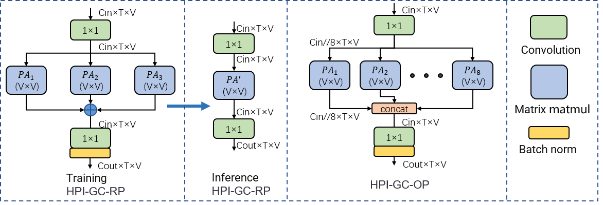
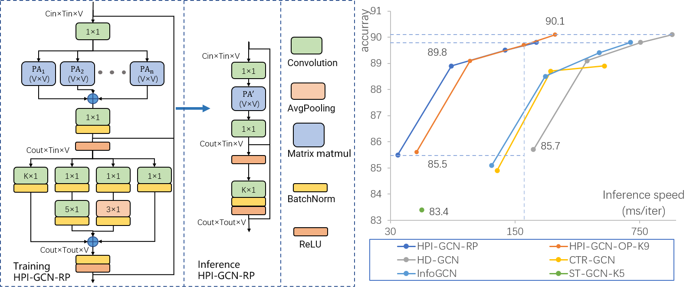

# HPI-GCN
Note: We provide the training and inference weights of HPI-GCN on NTU120 CSub with joint modality only, 
achieving 85.6%, 86.0%, and 85.5% for HPI-GCN-OP-K9, HPI-GCN-OP-K5, and HPI-GCN-RP-K5, respectively.

## More detailed experimental results
We report the top-1 accuracy (%) and inference speed (in milliseconds per iteration on a NVIDIA RTX 3090 GPU with batch size 64 and full precision 
(fp32)) of HPI-GCN-RP and HPI-GCN-OP-K9 on the NTU-RGB+D 120 and NTU-RGB+D 60 benchmark with multi-stream models.

| Model         | NTU120 X-Sub (%) | NTU120 X-Set (%) | NTU60 X-Sub (%) | NTU60 X-View (%) | Infer-speed (ms/iter) |
|---------------|:----------------:|:----------------:|:---------------:|:----------------:|:---------------------:|
| HPI-GCN-RP    |       85.5       |       86.4       |      90.2       |       95.1       |          33           |
| 2-stream      |       88.9       |       89.9       |      92.3       |       96.3       |          66           |
| 4-stream      |       89.5       |       90.7       |      92.6       |       96.6       |          132          |
| 6-stream      |       89.8       |       90.9       |      92.8       |       96.8       |          198          |
| HPI-GCN-OP-K9 |       85.6       |       87.2       |      90.3       |       95.6       |          42           |
| 2-stream      |       89.1       |       90.3       |      92.4       |       96.5       |          84           |
| 4-stream      |       89.7       |       91.1       |      92.8       |       96.9       |          168          |
| 6-stream      |       90.1       |       91.5       |      93.0       |       97.0       |          252          |


## Architecture of HPI-GC


## Structure of HPI-GCN-RP

We provide a comparison of the HPI-GCN-RP architecture and its performance against other SOTA models in terms of accuracy and inference speed. 


# Prerequisites
- Python >= 3.6
- PyTorch >= 1.1.0
- PyYAML, tqdm, tensorboardX

- We provide the dependency file of our experimental environment, you can install all dependencies by creating a new anaconda virtual environment and running `pip install -r requirements.txt `
- Run `pip install -e torchlight`

#### NTU RGB+D 60 and 120

1. Request NTU RGB+D 120 Skeleton dataset
2. Download the skeleton-only datasets:
   1. `nturgbd_skeletons_s001_to_s017.zip` (NTU RGB+D 60)
   2. `nturgbd_skeletons_s018_to_s032.zip` (NTU RGB+D 120)
   3. Extract above files to `./data/nturgbd_raw`


### Data Processing
- To replicate the accuracy of the model, you need to install the dataset to the specified location and run the next Data Processing.

#### Directory Structure
- Put downloaded data into the following directory structure:

```
- data/
  - ntu/
  - ntu120/
  - nturgbd_raw/
    - nturgb+d_skeletons/     # from `nturgbd_skeletons_s001_to_s017.zip`
      ...
    - nturgb+d_skeletons120/  # from `nturgbd_skeletons_s018_to_s032.zip`
      ...
```

#### Generating Data

- Generate NTU RGB+D 60 or NTU RGB+D 120 dataset:

```
 cd ./data/ntu # or cd ./data/ntu120
 # Get skeleton of each performer
 python get_raw_skes_data.py
 # Remove the bad skeleton 
 python get_raw_denoised_data.py
 # Transform the skeleton to the center of the first frame
 python seq_transformation.py
```

# Training & Testing

### Training

- Change the config file depending on what you want.

```
# Example: training HPI-GCN-OP-K9 on NTU RGB+D 120 cross subject with GPU 0
python main.py --config config/nturgbd120-cross-subject/HPI_GCN_OP.yaml --model_args deploy=False --work-dir work_dir/ntu120/xsub/HPI_GCN_OP_joint0 --device 0
```

### Transformer
- After training, convert the training weights to inference weights.
```
# Example: training HPI-GCN-OP-K9 on NTU RGB+D 120 cross subject with GPU 0
python Transformer.py --load ./test_weights/weight_ntu120/HPI_120CSub_OP_T9K9_j0/runs-94-46248.pt --save ./test_weights/weight_ntu120/HPI_120CSub_OP_T9K9_j0/inferHPI_OP_K9.pt --arch HPI_GCN_OP

```

### Testing

- To test the trained models saved in ./test_weights/weight_ntu120/HPI_120CSub_OP_T9K9_j0, run the following command, 
and you will get HPI-GCN-OP-K9 test weight achieving 85.6% on NTU120 CSub with joint modality only.
```
python main.py --phase test --config config/nturgbd120-cross-subject/HPI_GCN_OP.yaml --model_args deploy=True --weights ./test_weights/weight_ntu120/HPI_120CSub_OP_T9K9_j0/inferHPI_OP_K9.pt --device 0
```

### Ensemble
- To ensemble the results of different modalities, you need to train the six-stream model first. Run the following command:

```
python Mensemble.py --dataset ntu120/xsub
```
